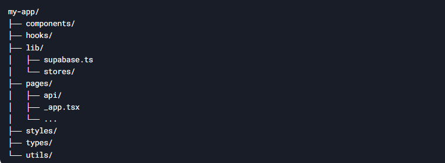
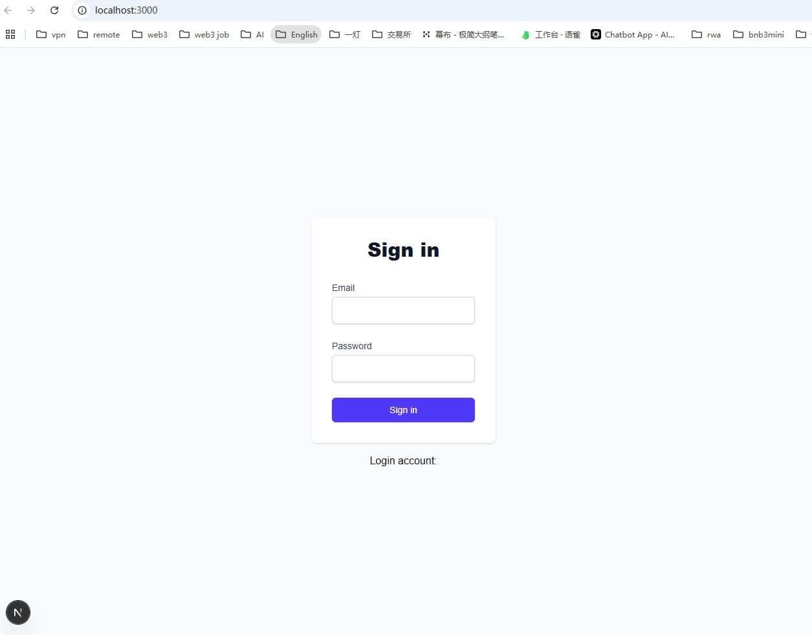
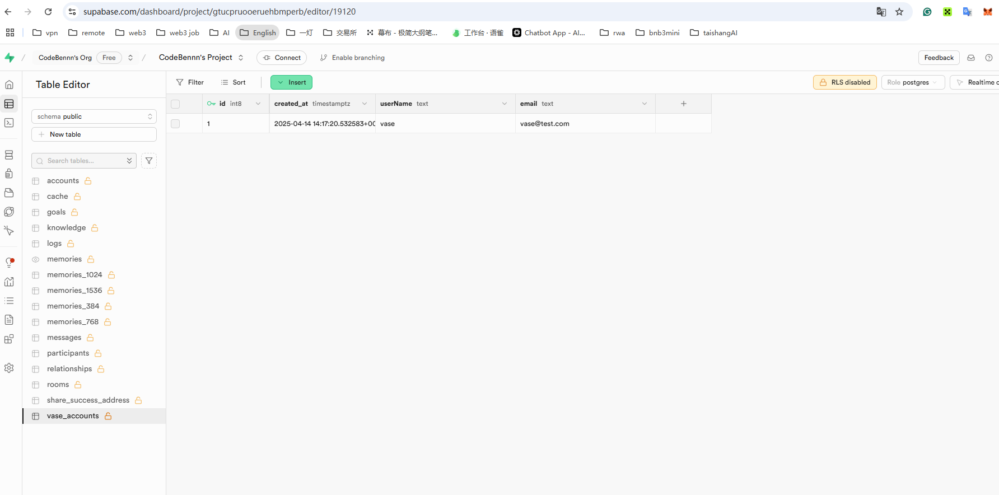

This is a Next.js project bootstrapped with create-next-app.

npx create-next-app@latest my-app
cd my-app

npm install zustand @supabase/supabase-js
npm install -D tailwindcss postcss autoprefixer
npx tailwindcss init

data in supabase

NEXT_PUBLIC_SUPABASE_URL=https://gtucpruooeruehbmperb.supabase.co
NEXT_PUBLIC_SUPABASE_ANON_KEY=e1yJhbGciOiJIUzI1NiIsInR5cCI6IkpXVCJ9.eyJpc3MiOiJzdXBhYmFzZSIsInJlZiI6Imd0dWNwcnVvb2VydWVoYm1wZXJiIiwicm9sZSI6ImFub24iLCJpYXQiOjE3MzU1NTc1NTUsImV4cCI6MjA1MTEzMzU1NX0.CUd4Vp5_xNReno7Qgjo7HMHcCBMT98RGedbxef4KfQk

